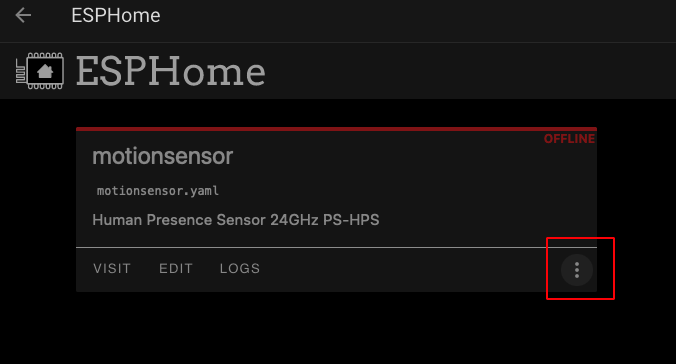
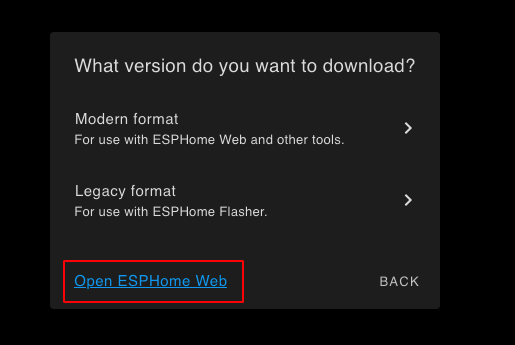
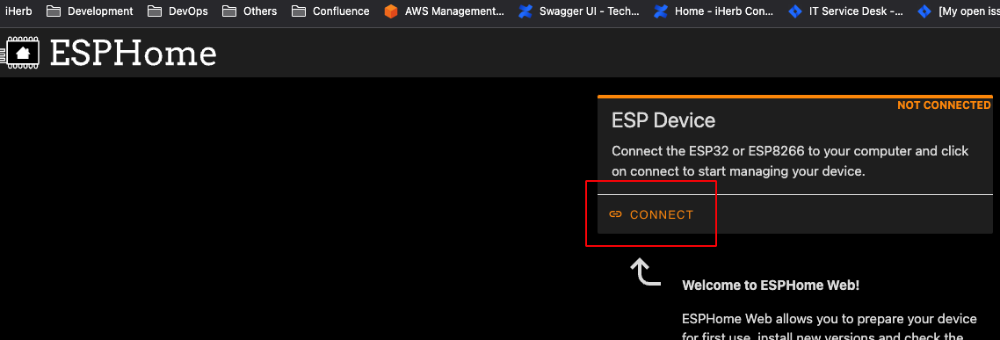
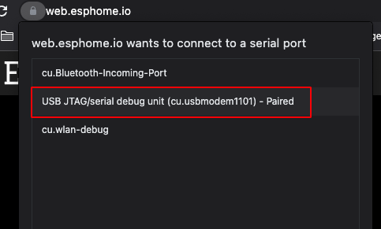

# Instruction 

- Clone this repository. 
- Install Home Assistant ESPHome and Visual Studio Code add-ons if you haven't installed it yet.
- Using Visual Studio Code add-ons, navigate to the `config/esphome` folder. Copy folder `custom-components` and `motionsensor.yaml` on this folder.
- Open ESPHome WebUI. You should see the `motionsensor` OFFLINE. If not try restarting HomeAssistant. 

- Click the 3 dot then `install`. Select `Manual download` > `Modern Format`. This should start compiling. Once it's done, it should automatically download a bin file. 
- Click the 3 dot again then `Install`. Select `Manual download` but this time click the `Open ESPHome Web`. Make sure you are using Chrome based broweser as Firefox doesn't support WebSerial.

- Click `Connect` then select `USB JTAG***` then click `Connect`.

- Click `Install` > `Choose File`. Browse the bin downloaded before. Click `Install` button. 
- Wait for the installation to be completed. 
- The device will automatically restart and switch to AP mode. Using your mobile or your computer wifi, connect to the device configure the wifi. The device name should be `MOTION SENSOR`.
- Once connected, it should automatically pop-up a window to select Wifi Router. If not, use any browser and visit `http://192.168.4.1`. Select your wifi router and enter the password and click save.
- The device should restart again and should connect automatically to your router. From this point the Home Assistsant should automatically detect new devices. Just follow the instruction. 

